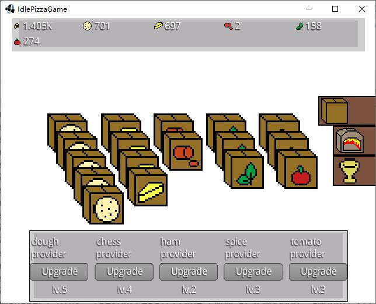

This project created in [low-effort-jam-18](https://itch.io/jam/low-effort-jam-18) for the theme `Pizza`. It's low-effort as it reuses the self-made idle game framework from [another project](https://github.com/hundun000/BugIndustry) and uses simple textures.

## idle pizza

An idle game. 

Now You are a manager of a pizza restaurant. For no reason, you can gain free food material continuously. You also can use ovens make pizza by different recipes and gain cions, upgrade providers and ovens. Finally collect enough cions for the goal.

### release

Download the zip. Use the win64 exe file, or the jar file.

### How to play

- The new game start with some working food material providers.

- Area-change-button is on the right border. Now we change to ovens-area.

- Some constuctions can swtich working-level by "+" / "-" button. Now we enable 1-level classical-pizza-oven and gain coins. 

- Upgrade other constuctions if your can afford its upgrade-cost. And constuction only work if your can afford its auto-work-cost.

### Assert thanks

Audio:
https://opengameart.org/content/happy-bgm-100116
